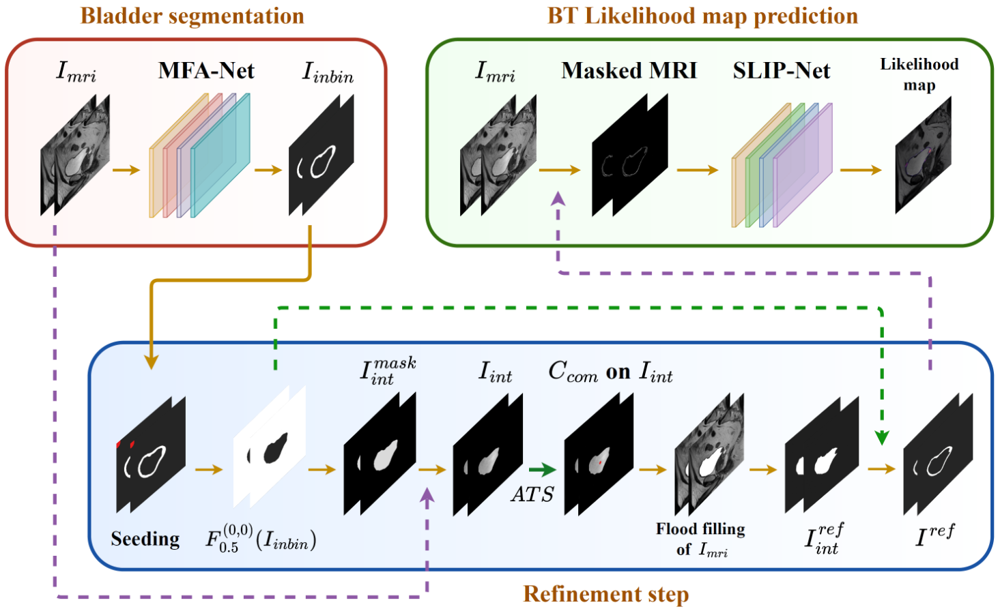
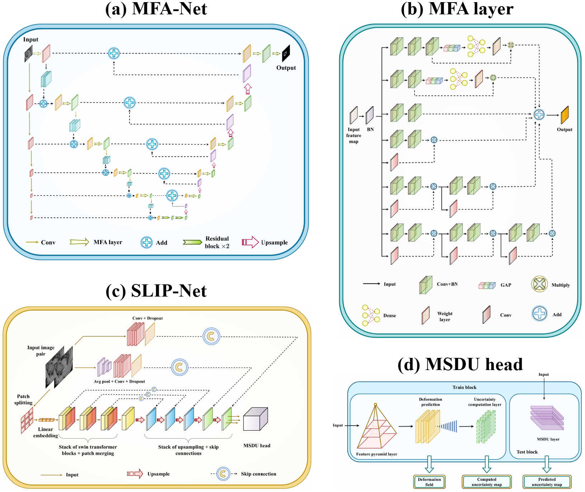

# ELAAI Framework

This repository implements the **Explainable and Likelihood-Aware AI (ELAAI)** framework, featuring:

- **MFA-Net**: Multi-scale Feature Aggregation network for robust bladder segmentation
- **Refinement Step**: A two-phase strategy to enhance MFA-Net predicted masks
- **SLIP-Net**: Swin-Transformer backbone with MSDU head for pixel-level tumour-likelihood estimation  

## 🧩 Methodology Overview

  

---

## 🏗️ Model Architectures

The ELAAI framework is composed of the following core designs:
- **MFA-Net**: Multi-scale Feature Aggregation network  
- **Refinement Module**: Two-phase correction strategy  
- **SLIP-Net**: Swin-Transformer with MSDU head  
- **Tumour-Likelihood Estimator**: Pixel-level confidence mapping  

  

---

<!--
## 📂 Model Checkpoints

Pre-trained weights are available for both networks. Please download and place them in the following directories before running experiments:

| Model     | Download Link                                                                                                    | Destination Path                                                                                                  |
|-----------|------------------------------------------------------------------------------------------------------------------|-------------------------------------------------------------------------------------------------------------------|
| MFA-Net   | [Google Drive](https://drive.google.com/file/d/18_hG6FWS_Wf7qxi9CvRPujajGLEQkrPK/view?usp=drive_link)              | `./MFA_Net/ModelSaveTensorFlow/MFANet.h5`                                      |
| SLIP-Net  | [Google Drive](https://drive.google.com/file/d/1DfUrKidnrZwmjbPDDx-WmttUZyBNX_Mq/view?usp=drive_link)              | `./SLIP_Net/experiments/SLIP_ssim_1_diffusion_1/dsc0.999.pth.tar`                                                 |

---

-->

## 📦 Code Archive & Citation

The code and data underpinning our publication have been permanently archived and can be referenced via the following DOI badge:

Please cite this DOI in any attribution or reproduction of our work:

---

## 📬 Correspondence

For questions, issues or collaboration inquiries, please contact:

**Dr Muzammil Khan**  
Robotics & Mechatronics Group, University of Twente  
✉️ [m.khan@utwente.nl](mailto:m.khan@utwente.nl)  

